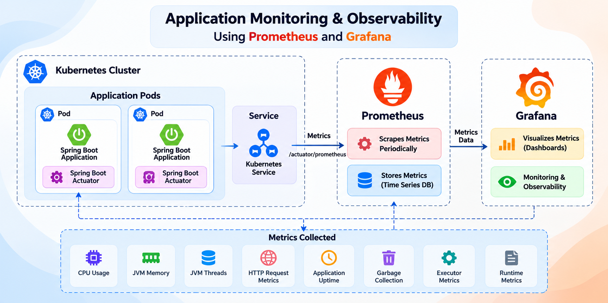
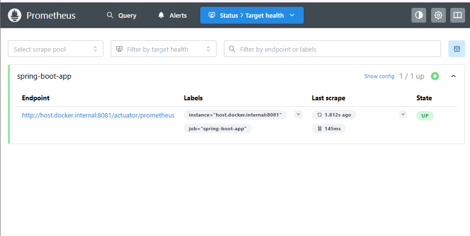
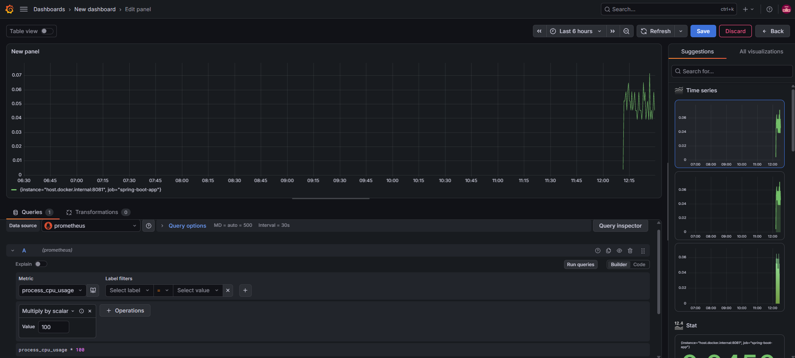

# DevOps Monitoring & Observability

A hands-on DevOps project demonstrating **CI/CD, Docker, Kubernetes, GitOps, and application monitoring & observability** using **Spring Boot Actuator, Prometheus, and Grafana**.

The project implements an end-to-end workflow where a code change moves from **GitHub → Jenkins → Docker Hub → GitOps Repository → Argo CD → Kubernetes**, and the deployed application is monitored using **Prometheus and Grafana**.

---

## 🚀 Project Overview

This project focuses on integrating **monitoring and observability** into a complete DevOps workflow.

The Spring Boot application is:

- Built and tested using Maven
- Analyzed using SonarQube
- Containerized using Docker
- Stored in Docker Hub
- Deployed to Kubernetes
- Managed using GitOps with Argo CD
- Exposed with monitoring metrics using Spring Boot Actuator
- Scraped by Prometheus
- Visualized using Grafana

### Complete Workflow

```text
Developer
    |
    | git push
    v
GitHub Application Repository
    |
    | Webhook
    v
Jenkins
    |
    +---- Maven Build
    |
    +---- Run Tests
    |
    +---- SonarQube Analysis
    |
    +---- Docker Build
    |
    +---- Docker Push
              |
              v
         Docker Hub
              |
              v
     Update Kubernetes Manifest
              |
              v
GitHub Manifest Repository
              |
              | Git Change
              v
          Argo CD
              |
              | Auto Sync
              v
        Kubernetes
          / Minikube
              |
              v
    Spring Boot Application
              |
              v
     Spring Boot Actuator
              |
              v
          Prometheus
              |
              v
           Grafana
              |
              v
     Monitoring Dashboard
```

---

## 🏗️ Architecture



The architecture consists of two major workflows:

### 1. CI/CD + GitOps Workflow

```text
GitHub
   |
   v
Jenkins
   |
   +--> Maven Build
   |
   +--> Tests
   |
   +--> SonarQube
   |
   +--> Docker Build
   |
   +--> Docker Push
   |
   v
Docker Hub
   |
   v
Kubernetes Manifest Repository
   |
   v
Argo CD
   |
   v
Kubernetes
```

### 2. Monitoring Workflow

```text
Spring Boot Application
        |
        v
Spring Boot Actuator
        |
        v
/actuator/prometheus
        |
        v
Prometheus
        |
        v
Grafana
        |
        v
Monitoring Dashboard
```

---

# 🛠️ Technology Stack

| Technology | Purpose |
|---|---|
| Java | Application development |
| Spring Boot | Backend application |
| Spring Boot Actuator | Health checks and application metrics |
| Micrometer | Prometheus-compatible metrics |
| Maven | Build and test automation |
| Git | Version control |
| GitHub | Source code and manifest repositories |
| GitHub Webhook | Jenkins pipeline trigger |
| Jenkins | CI/CD automation |
| SonarQube | Code quality analysis |
| Docker | Application containerization |
| Docker Hub | Container image registry |
| Kubernetes | Container orchestration |
| Minikube | Local Kubernetes cluster |
| Argo CD | GitOps continuous deployment |
| Prometheus | Metrics collection and storage |
| Grafana | Metrics visualization |
| YAML | Kubernetes and monitoring configuration |

---

# 📦 Application

The project uses a simple Spring Boot application as the monitored service.

### Application Endpoint

```text
/
```

### Application Response

```text
DevOps Monitoring & Observability Demo
```

### Application Port

```text
8080
```

---

# 🔄 CI/CD Pipeline

The Jenkins pipeline automates the application build, testing, code analysis, containerization, and Kubernetes manifest update process.

## Pipeline Stages

```text
Git Push
   |
   v
GitHub Webhook
   |
   v
Jenkins
   |
   +--> Maven Build
   |
   +--> Automated Tests
   |
   +--> SonarQube Analysis
   |
   +--> Docker Build
   |
   +--> Docker Push
   |
   +--> Update Kubernetes Manifest
   |
   v
GitHub Manifest Repository
```

### 1. Maven Build

Maven compiles and packages the Spring Boot application.

```text
Maven
  |
  v
Compile
  |
  v
Package
  |
  v
Application JAR
```

### 2. Automated Testing

Tests are executed using Maven.

```text
Application
    |
    v
Maven Test
    |
    v
Test Result
```

### 3. SonarQube Analysis

SonarQube analyzes the application code for code quality issues and potential problems.

### 4. Docker Build

Jenkins creates a Docker image containing the Spring Boot application.

The image is tagged using the Jenkins build number.

```text
manjugowda200523/devops-monitoring-observability:<BUILD_NUMBER>
```

Example:

```text
Build #1
    |
    v
devops-monitoring-observability:1
```

### 5. Docker Push

The generated Docker image is pushed to Docker Hub.

### 6. Manifest Update

After the Docker image is pushed, Jenkins updates the image tag inside the Kubernetes `deployment.yaml`.

The updated manifest is committed and pushed to the separate GitHub manifest repository.

---

# 🐳 Docker

The Spring Boot application is packaged into a Docker image.

### Docker Flow

```text
Java Runtime
     |
     v
Working Directory
     |
     v
Application JAR
     |
     v
Expose Port 8080
     |
     v
Start Spring Boot
```

The Docker image is versioned using the Jenkins build number.

This makes each image traceable to a specific CI pipeline execution.

---

# ☸️ Kubernetes Deployment

The application runs on a Kubernetes cluster created using **Minikube**.

### Kubernetes Resources

```text
Deployment
    |
    v
ReplicaSet
    |
    v
Pods
    |
    v
Service
    |
    v
Application
```

## Deployment

The Kubernetes Deployment manages the desired number of application replicas.

The application runs with:

```text
2 replicas
```

## ReplicaSet

The ReplicaSet ensures that the required number of Pods are running.

## Pods

The Pods run the Docker container containing the Spring Boot application.

## Service

A Kubernetes Service provides networking to the application Pods.

---

# ♻️ Kubernetes Self-Healing

Kubernetes maintains the desired state of the application.

If a running Pod is deleted, Kubernetes automatically creates a replacement Pod.

```text
Running Pod
     |
     v
Pod Deleted
     |
     v
Kubernetes detects desired-state mismatch
     |
     v
New Pod created
     |
     v
Application running again
```

This demonstrates Kubernetes' **self-healing capability**.

The application can also run with multiple replicas to demonstrate scaling.

---

# 🔁 GitOps with Argo CD

Argo CD is used for continuous deployment using the **GitOps approach**.

Instead of Jenkins directly deploying the application to Kubernetes, Jenkins updates the desired Kubernetes configuration in Git.

Argo CD detects the Git change and synchronizes Kubernetes with the desired state.

```text
Jenkins
   |
   | Update image tag
   v
GitHub Manifest Repository
   |
   | Git change detected
   v
Argo CD
   |
   | Auto Sync
   v
Kubernetes
```

---

## ⚡ Argo CD Auto-Sync

Auto-Sync is enabled for the application.

When Jenkins changes the image version in the manifest repository:

```text
Git Change
    |
    v
Argo CD detects change
    |
    v
Automatic Sync
    |
    v
Kubernetes Deployment Updated
    |
    v
New ReplicaSet
    |
    v
New Pods
```

This allows the deployment process to remain Git-driven.

---

# 📊 Monitoring & Observability

The primary focus of this project is **application monitoring and observability**.

The monitoring workflow is:

```text
Spring Boot Application
        |
        v
Spring Boot Actuator
        |
        v
/actuator/prometheus
        |
        v
Prometheus
        |
        v
Grafana
        |
        v
Monitoring Dashboard
```

---

# ❤️ Spring Boot Actuator

Spring Boot Actuator provides endpoints for monitoring the application.

### Exposed Endpoints

```text
/actuator/health
/actuator/metrics
/actuator/prometheus
```

### Health

The health endpoint provides the current health status of the application.

```text
/actuator/health
```

### Metrics

The metrics endpoint provides available application and JVM metrics.

```text
/actuator/metrics
```

### Prometheus

The Prometheus endpoint exposes application metrics in a Prometheus-compatible format.

```text
/actuator/prometheus
```

---

# 📈 Micrometer

Micrometer is used to provide Prometheus-compatible metrics for the Spring Boot application.

The application exposes metrics through:

```text
/actuator/prometheus
```

These metrics can then be scraped by Prometheus.

---

# 🔥 Prometheus

Prometheus is used to collect and store application metrics.

Prometheus periodically scrapes the Spring Boot application's Prometheus endpoint.

### Prometheus Configuration

```yaml
global:
  scrape_interval: 15s

scrape_configs:
  - job_name: 'spring-boot-app'
    metrics_path: '/actuator/prometheus'
```

### Metrics Collected

The application exposes metrics such as:

- CPU usage
- JVM memory
- JVM threads
- HTTP request metrics
- Application startup metrics
- Garbage collection metrics
- Executor metrics
- Runtime metrics

---

# 📊 Grafana

Grafana is used to visualize the metrics collected by Prometheus.

Prometheus is configured as the Grafana data source.

The Grafana dashboard provides visualization for application and runtime metrics.

### Example Metrics

- CPU Usage
- JVM Memory
- JVM Threads
- HTTP Metrics
- Application Metrics
- Runtime Metrics

### Grafana Monitoring Flow

```text
Application
     |
     v
Actuator
     |
     v
Prometheus Metrics
     |
     v
Prometheus
     |
     v
Grafana Data Source
     |
     v
Grafana Dashboard
```

---

# ⚙️ Monitoring Configuration

The required monitoring endpoints are exposed through `application.properties`.

```properties
management.endpoints.web.exposure.include=health,metrics,prometheus
```

Prometheus uses:

```text
/actuator/prometheus
```

to collect application metrics.

Grafana then uses Prometheus as its data source for visualization.

---

# 📁 Project Structure

```text
devops-monitoring-observability/
│
├── src/
│   ├── main/
│   │   ├── java/
│   │   │   └── com/
│   │   │       └── manju/
│   │   │           └── devops_monitoring/
│   │   │               ├── DevopsMonitoringApplication.java
│   │   │               └── MonitoringController.java
│   │   │
│   │   └── resources/
│   │       └── application.properties
│   │
│   └── test/
│
├── monitoring/
│   └── prometheus.yml
│
├── Dockerfile
├── Jenkinsfile
├── pom.xml
└── README.md
```

---

# 🗂️ GitHub Repositories

## Application Repository

The application repository contains:

- Spring Boot application
- Monitoring configuration
- Docker configuration
- Jenkins pipeline
- Maven configuration

```text
devops-monitoring-observability
│
├── src/
├── monitoring/
├── Dockerfile
├── Jenkinsfile
├── pom.xml
└── README.md
```

## Manifest Repository

The Kubernetes manifest repository contains the desired Kubernetes state.

```text
devops-monitoring-manifests
│
├── deployment.yaml
└── service.yaml
```

Keeping Kubernetes manifests in a separate repository allows application source code and deployment configuration to be managed independently.

---

# 🔑 Key Components

| Component | Purpose |
|---|---|
| Spring Boot | Application |
| Spring Boot Actuator | Health and application metrics |
| Micrometer | Prometheus-compatible metrics |
| Prometheus | Collects and stores metrics |
| Grafana | Visualizes metrics |
| Maven | Builds and tests the application |
| Jenkins | Automates CI/CD |
| SonarQube | Performs code quality analysis |
| Docker | Containerizes the application |
| Docker Hub | Stores container images |
| Kubernetes | Runs the application |
| Minikube | Provides local Kubernetes cluster |
| Argo CD | Performs GitOps-based deployment |
| GitHub | Stores application and manifest repositories |

---

# ✅ What I Implemented

- Created a Spring Boot application
- Added Spring Boot Actuator
- Added Micrometer Prometheus registry
- Exposed application health metrics
- Exposed application metrics
- Exposed Prometheus metrics
- Created a Docker image
- Pushed the image to Docker Hub
- Created a Jenkins CI/CD pipeline
- Added Maven build and testing
- Added SonarQube code analysis
- Deployed the application to Kubernetes
- Configured Kubernetes Deployment
- Configured Kubernetes Service
- Used Argo CD for GitOps deployment
- Maintained Kubernetes manifests in a separate Git repository
- Configured Prometheus for metric collection
- Connected Grafana to Prometheus
- Created a Grafana monitoring dashboard
- Verified application metrics
- Integrated monitoring into the CI/CD + GitOps workflow

---

# 🧠 Key Learning

This project helped me understand how **monitoring and observability fit into a modern DevOps workflow**.

The monitoring pipeline is:

```text
Application
     |
     v
Actuator
     |
     v
Prometheus
     |
     v
Grafana
```

The project demonstrates how application metrics are:

1. Exposed by Spring Boot Actuator
2. Collected and stored by Prometheus
3. Visualized using Grafana

It also demonstrates how monitoring can be integrated with a **Kubernetes-based CI/CD and GitOps deployment workflow**.

---

# 🔄 Complete Deployment & Monitoring Lifecycle

```text
                         SOURCE
                           |
                           v
                    GitHub Application
                           |
                           v
                     GitHub Webhook
                           |
                           v
                         Jenkins
                           |
              +------------+------------+
              |            |            |
              v            v            v
           Maven       SonarQube      Docker
           Build        Analysis       Build
              |                         |
              v                         v
            Tests                   Docker Hub
                                       |
                                       v
                              Manifest Repository
                                       |
                                       v
                                    Argo CD
                                       |
                                       v
                                   Auto Sync
                                       |
                                       v
                                  Kubernetes
                                       |
                                       v
                                      Pods
                                       |
                                       v
                                    Service
                                       |
                                       v
                             Spring Boot App
                                       |
                                       v
                              Spring Boot Actuator
                                       |
                                       v
                                  Prometheus
                                       |
                                       v
                                    Grafana
                                       |
                                       v
                              Monitoring Dashboard
```

---

# 🎯 Project Result

The complete **CI/CD + GitOps + Monitoring & Observability** workflow was implemented and tested.

A single application code change can travel through the complete workflow:

```text
Git Push
   |
   v
GitHub
   |
   v
Jenkins
   |
   v
Maven Build
   |
   v
Tests
   |
   v
SonarQube
   |
   v
Docker Build
   |
   v
Docker Hub
   |
   v
Manifest Update
   |
   v
GitHub Manifest Repository
   |
   v
Argo CD
   |
   v
Kubernetes
   |
   v
Spring Boot Application
   |
   v
Actuator
   |
   v
Prometheus
   |
   v
Grafana
   |
   v
Monitoring Dashboard
```

---

# 📸 Screenshots

### Architecture


### Prometheus



### Grafana Dashboard



> Add or remove screenshot sections based on the screenshots actually present in the repository.

---

# 📌 Related Projects

### DevOps CI/CD Demo

Complete CI/CD and GitOps implementation.

### DevOps Monitoring Manifests

Kubernetes manifests used for the deployment.

---


**CI/CD → Docker → Kubernetes → GitOps → Monitoring & Observability**

workflow.
